## My Dream Car

### 3200105085 丛箫言

### 11.27 作业要求

1. Program using 2 modeling techniques in class to build the shape of  the dream car
2. Compare the strengths and weaknesses of the techniques you use
3. Render your car in the same viewer as in the solar system assignment

### 12.4 作业要求

1. Add simple diffuse + specular (Phong or Cook\-Torrance) models in your existing solar system
2. The sun is treated as a single, distant point light source

### 12.14 作业要求

1. Add textures to your solar system
2. **Bonus 10%: Implement a skybox**

### 相关部分GitHub链接

1. 太阳系 https://github.com/xy-cong/SolarSystem
2. My Dream Car https://github.com/xy-cong/MyCar
3. Solarsystem_DreamCar https://github.com/xy-cong/Solarsystem_Dreamcar

### 作业内容

1. 使用 **Polygonal Mesh** 和 **3D-Bezier Surface** 两种基本建模方法构建Dream Car

   ​	利用 .obj 文件给定相关物体vertex和surface信息

   1. **Polygonal Mesh：**

      - .obj 文件提供 v, vn, vt, f 四类信息

        - ```
          #v
          v 0.506094 0.045250 -1.798817
          v 0.471644 0.058068 -1.755149
          v 0.428828 0.018090 -1.871082
          v 0.473735 0.035180 -1.812524
          
          #vn
          vn -0.387215 0.844937 0.368981
          vn -0.237494 0.749655 -0.617749
          vn -0.038075 0.522142 0.852008
          vn -0.042688 0.481185 0.875579
          
          #vt
          vt 0.593756 0.014001
          vt 0.590443 0.019189
          vt 0.572267 0.013866
          vt 0.589488 0.020228
          
          #f
          f 253/1/1 226/2/2 252/3/3
          f 228/4/4 227/5/4 226/2/2
          f 253/1/1 233/6/5 234/2/6
          f 235/4/7 234/2/6 233/6/5
          ```

        - v : List of geometric vertices, with (x,y,z[,w]) coordinates, w is optional and defaults to 1.0. 

        - vn : List of vertex normals in (x,y,z) form; normals might not be unit vectors. 

        - vt : List of texture coordinates, in (u, v [,w]) coordinates, these will vary between 0 and 1, w is optional and defaults to 0. 

        - f : Polygonal face element

          - f的信息可以有多种组合：
            - f: v1, v2, v3
            - f: v1/vn1, v2/vn2, v3/vn3
            - f: v1/vt1/vn1, v2/vt2/vn2, v3/vt3/vn3

      - 本次作业中仅使用vertex信息和vertex组合的f信息即完成了polygonal mesh的绘制

        - ```c++
          glBegin(GL_TRIANGLES);
          # in Loop:
              glNormal3f(VN[0], VN[1], VN[2]);//绘制法向量
          
              glVertex3f(SV1[0], SV1[1], SV1[2]);//绘制三角面片
              glVertex3f(SV2[0], SV2[1], SV2[2]);
              glVertex3f(SV3[0], SV3[1], SV3[2]);   
          glEnd();
          ```

   2. **3D-Bezier Surface**    

      1. 利用 .obj 文件给定相关Bezier Surface的控制点，本作业中以 4*4=16 个控制点为例。

         1. ```
            v -0.330351 0.665978 0
            v -0.125420 0.665978 0
            v 0.133710 0.665978 0
            v 0.321758 0.665978 0
            ```

      2. 通过 glMapGrid2f 函数生成控制点控制下的Bezier Surface需要的Grid

         ```c++
         void Bezier_Obj_Loader::init(){
             glMap2f(GL_MAP2_VERTEX_3, 0, 1, 3, 4, 0, 1, 12, 4, &ctrlPoints[0][0][0]);
             glEnable(GL_MAP2_VERTEX_3);
             glMapGrid2f(20, 0.0, 1.0, 20, 0.0, 1.0);
             glDepthFunc(GL_LESS);
             glEnable(GL_DEPTH_TEST);
             glEnable(GL_AUTO_NORMAL);
             glEnable(GL_NORMALIZE);
         }
         ```

      3. 通过 glEvalMesh2 函数绘制控制点控制下的Bezier Surface

         ```c++
         void Bezier_Obj_Loader::Draw(){
             glColor3f(1.0, 0.0, 0.0);
             glPushMatrix();
             glEvalMesh2(GL_FILL, 0, 20, 0, 20);
             glPopMatrix();
             glutSwapBuffers();
         }
         ```

2. **Dream Car 效果展示**

   Dream Car车体使用Polygonal Mesh建模，车顶上方使用Bezier Surface生成一面旗。

   1. **整体效果图**

      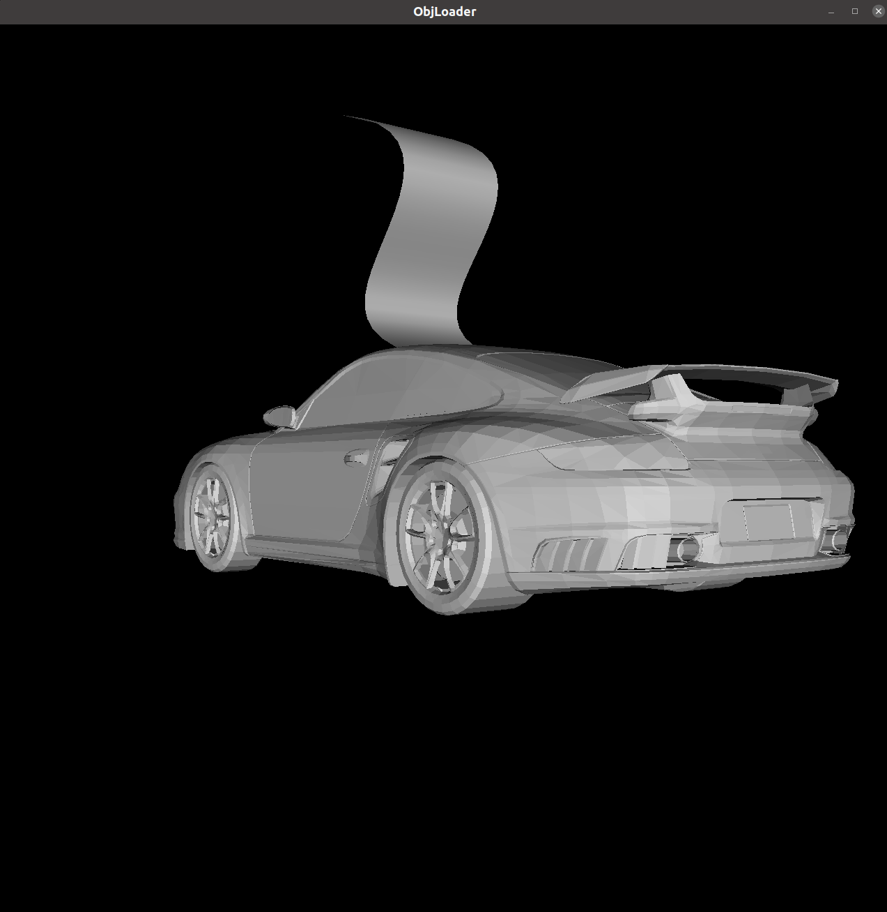

   2. **Polygonal Mesh 车体细节**

      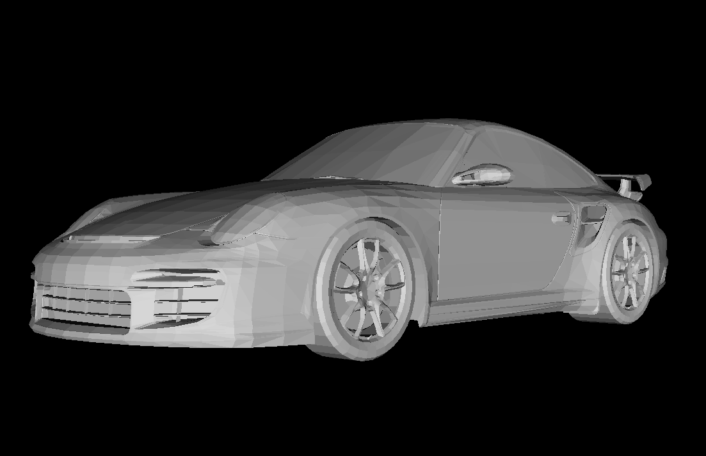

   3. **Bezier Surface 车顶细节**

      

   4. **需要特别注意的是，为了更方便、更清晰地展现表面建模效果，加入了点光源**

      ```c++
      //安置光源
      void setLightRes() {
          GLfloat lightPosition[] = { 0.0f, 0.0f, 1.0f, 0.0f };
          glLightfv(GL_LIGHT0, GL_POSITION, lightPosition);
          glEnable(GL_LIGHTING); //启用光源
          glEnable(GL_LIGHT0);   //使用指定灯光
      }
      ```

      如果不使用该点光源，Dream Car 整体和局部的呈现效果如下

      1. **整体效果图**

         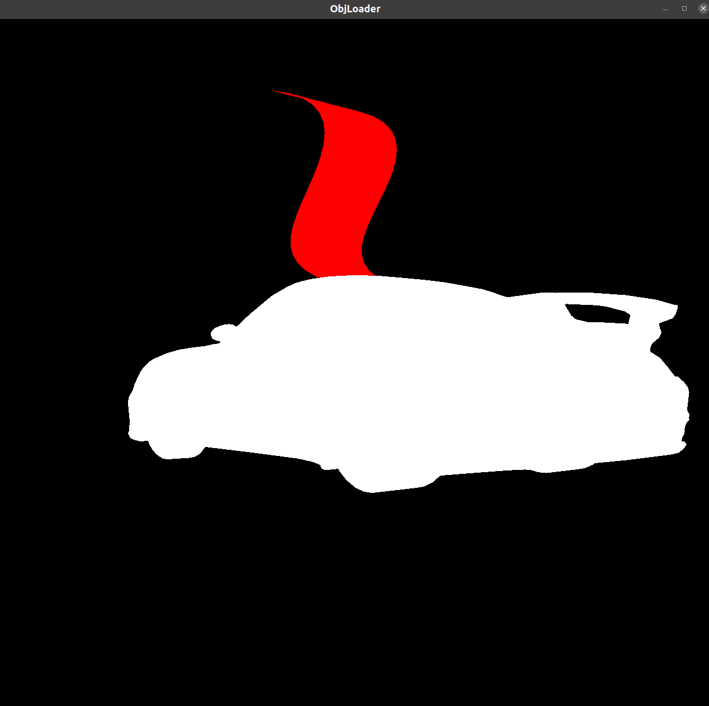

      2. **Polygonal Mesh 细节**

         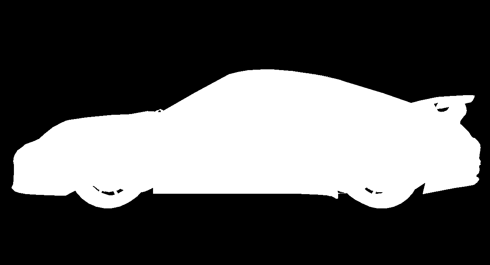

      3. **Bezier Surface 细节**

         

3. **至此，完成了两种建模方法对Dream Car进行表面建模实现。**

4. **比较两种建模方法的优劣：**

   1. Polygonal Mesh : 

      1. Strength：以三角面片为代表的Polygonal Mesh具有很强的表面表示能力，通过足够多的三角面片组合可以拟合得到任意需要建模的表面，同时建模较为简单、直接，物理意义明确，也非常容易处理，利用给定的顶点信息即可确定出平面，同时给定了法向量后也可以更好的建模光影效果。几乎是图形学中最为常见的几何建模方法。
      2. Weakness：Polygonal Mesh的问题也很明确，面和面之间不光滑，有突变，而真实世界中的很多事务要求点点光滑，这时候三角面片就不能很好的建模出真实世界，除此之外，对于几何结构非常复杂的物体，如果想要高精度地近似建模真实集合，需要存储大量的点、面、纹理坐标等信息，.obj文件的存储开销较大。

   2. Bezier Surface : 

      **任意阶数的贝塞尔曲线在时间t时的位置是由伯恩斯坦多项式作为系数对给定的控制点的加权**，同样，曲面则是通过给定二维控制信息u,v，做二维Bezier曲线并扩展到三维。核心思路是**de Castelijau算法**：对每个时间t，(n-1)次递归找控制点连接线的t分段位置点，n是控制点数量。最后可以总结为多项式（伯恩斯坦多项式）加权组合形式：

      1. Strength：基于Bezier曲线，可以实现生成的曲面点点光滑，有非常多有用的性质，比如曲线的、曲面的affine transformation可以转化为控制点的affine transformation，且拥有凸包性质，拥有更好、更精细、更平滑的表示能力。
      2. 问题是：由于曲面中的每一个点由de Castelijau算法递归计算得到，表面生成的时间开销较大，且受控制点影响较明显，当用太多的点去控制生成Bezier曲线的时候，曲线会趋向于直线，即综合太多控制点信息会导致一些特征的控制信息丢失（所以一般会采用三点控制生成一条Bezier曲线）。
      3. 同时，由于Bezier曲面是由一组控制点生成，当对某几个控制点的局部表面做修改的时候，必然会影响到其他表面信息。

5. **将Dream Car放入之前作业生成的太阳系中：**

   - 太阳系+Dream Car —— 未开光源：

     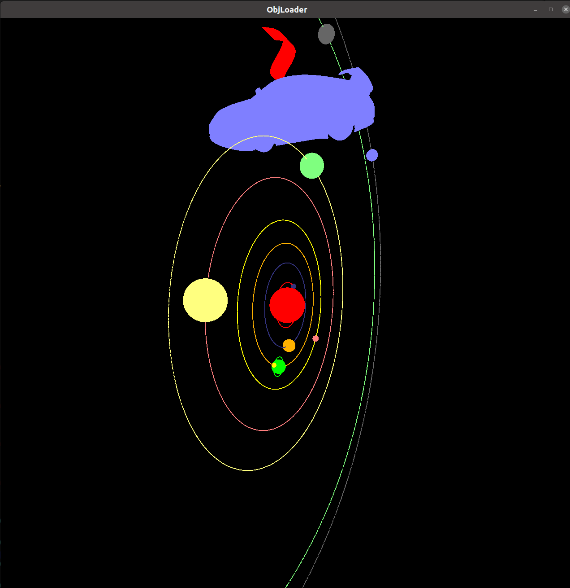

   - 太阳系+Dream Car —— 打开光源：

     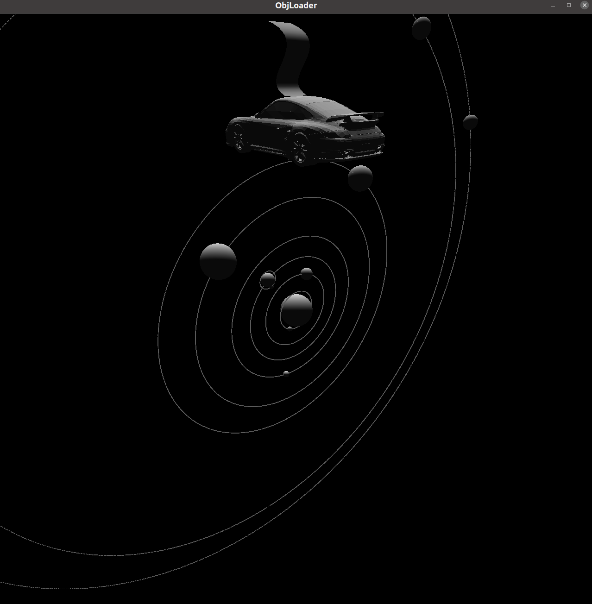

6. 有无光照的分析同上Dream Car部分，为了表示清楚集合表面重建信息，最好引入光源。

7. 本系统依然支持原来太阳系的所有功能，详见 https://github.com/xy-cong/SolarSystem

8. **引入Diffuse & Specular models**，并设置**点光源**

   1. 当点光源位于太阳：`GLfloat sun_light_position[] = { 0.0f, 0.0f, 0.0f, 1.0f };`  此时四元组的w设置为1.0表示为该光源为定点光源，位于(0,0, 0.0, 0.0)，但会随着观察方向改变而改变。

      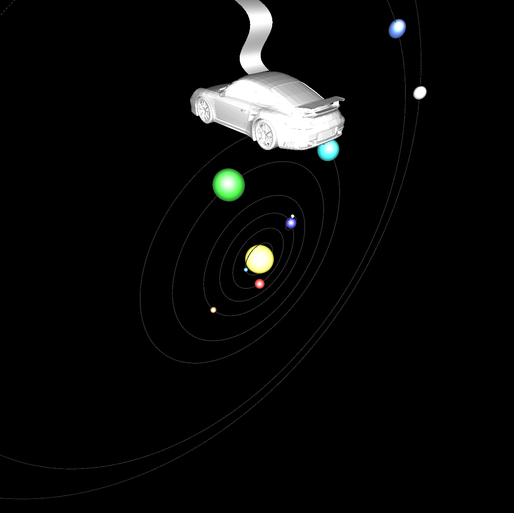

   2. 当点光源位于整个太阳系上方：`GLfloat sun_light_position[] = { 0.0f, 100.0f, 0.0f, 0.0f };`  

      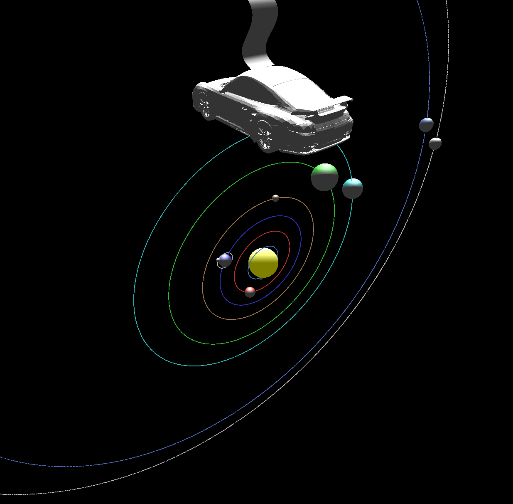

   3. 可以发现，二者有很大的区别，可以明显地感知到光源位置的变化。

   4. 同时，对每个星球都设置了漫反射和镜面反射，镜面反射均设置为白色， 而漫反射则定义了不同的颜色，即图中所展示的不同星球所展现出来的直观的颜色。

      ```c++
      // 以定义太阳的光照属性为例
      GLfloat sun_mat_ambient[]  = {0.0f, 0.0f, 0.0f, 1.0f};  //定义材质的环境光颜色
      GLfloat sun_mat_diffuse[]  = {1.0f, 1.0f, 1.0f, 1.0f};  //定义材质的漫反射光颜色
      GLfloat sun_mat_specular[] = {0.0f, 0.0f, 0.0f, 1.0f};  //定义材质的镜面反射光颜色
      GLfloat sun_mat_emission[] = {0.5f, 0.5f, 0.0f, 1.0f};  //定义材质的辐射广颜色
      GLfloat sun_mat_shininess = 0.0f;
      glMaterialfv(GL_FRONT, GL_AMBIENT, sun_mat_ambient);
      glMaterialfv(GL_FRONT, GL_DIFFUSE, sun_mat_diffuse);
      glMaterialfv(GL_FRONT, GL_SPECULAR, sun_mat_specular);
      glMaterialfv(GL_FRONT, GL_EMISSION, sun_mat_emission);
      glMaterialf(GL_FRONT, GL_SHININESS, sun_mat_shininess);
      ```

      ```c++
      // 以定义水星的光照属性为例
      GLfloat earth_mat_ambient[] = { 1.0f, 1.0f, 1.0f, 1.0f };  
      GLfloat earth_mat_diffuse[] = { 0.0f, 0.5f, 1.0f, 1.0f }; 
      GLfloat earth_mat_specular[] = { 0.8f, 0.8f, 0.8f, 0.2f };  
      GLfloat earth_mat_emission[] = { 0.0f, 0.0f, 0.0f, 1.0f };  
      GLfloat earth_mat_shininess = 5.0f;
      glMaterialfv(GL_FRONT, GL_AMBIENT, earth_mat_ambient);
      glMaterialfv(GL_FRONT, GL_DIFFUSE, earth_mat_diffuse);
      glMaterialfv(GL_FRONT, GL_SPECULAR, earth_mat_specular);
      glMaterialfv(GL_FRONT, GL_EMISSION, earth_mat_emission);
      glMaterialf(GL_FRONT, GL_SHININESS, earth_mat_shininess);
      ```

### 12.14 作业内容

1. Add textures to your solar system

   1. 找到了太阳系中各个星球共10张texture map，均存放在文件夹texture中。

      

   2. 程序逻辑

      实现texture mapping简单来说可以总结为四个步骤

      1. 创建纹理对象，并为它装载一个纹理
      2. 确定纹理如何应用到每个像素上
      3. 启用纹理贴图功能
      4. 绘制场景，提供纹理坐标和几何图形坐标

      接下来将详细介绍本代码的实现思路：

      - 首先，为了方便进行texture mapping，对每一个星球都改变了原来的球体生成方式，从原来的`glutSolidSphere(this->selfRadius, 100, 100);`改为如今的密集`glVertex3f()`空间采点生成球体，同时在生成空间点信息的同时，得到每一个空间点对应的纹理坐标，将空间点坐标和纹理作用用一个结构体组织起来。

        ```c++
        typedef struct
        {
            double X;
            double Y;
            double Z;
            double U;
            double V;
        } VERTICES;
        ```

        并通过`VERTICES VERTEX_STARS[Stars_N][VertexCount];`定义了Stars_N个星球，每一个星球都有VertexCount个结构点，存储着空间点信息和纹理坐标。

      - 每一个结构点的生成采用如下方式

        ```c++
        VERTEX_STARS[this->idx][n].X = R * sin((a) / 180 * PI) * sin((b) / 180 * PI);
        VERTEX_STARS[this->idx][n].Y = R * cos((a) / 180 * PI) * sin((b) / 180 * PI);
        VERTEX_STARS[this->idx][n].Z = R * cos((b) / 180 * PI);
        len = sqrt(VERTEX_STARS[this->idx][n].X * VERTEX_STARS[this->idx][n].X + VERTEX_STARS[this->idx][n].Y * VERTEX_STARS[this->idx][n].Y + VERTEX_STARS[this->idx][n].Z * VERTEX_STARS[this->idx][n].Z);
        VERTEX_STARS[this->idx][n].V = (2 * b) / 360;
        VERTEX_STARS[this->idx][n].U = (a) / 360;
        len2 = sqrt(VERTEX_STARS[this->idx][n].V * VERTEX_STARS[this->idx][n].V + VERTEX_STARS[this->idx][n].U * VERTEX_STARS[this->idx][n].U);
        VERTEX_STARS[this->idx][n].V /= len2;
        VERTEX_STARS[this->idx][n].U /= len2;
        ```

      - 在每一次构造一个新星球的时候，都在类GLstars的初始化函数里将纹理贴图texture mapping（bmp格式）读取为data（unsigned char * ）格式，并创建一个纹理对象，并绑定&生成相关参数。

        ```c++
        // 转换texture mapping
        int width, height;
        unsigned char * data;
        FILE * file;
        file = fopen( filename, "rb" );
        if ( file == NULL ) return;
        width = 2048;
        height = 1024;
        data = (unsigned char *)malloc( width * height * 3 );
        fread( data, width * height * 3, 1, file );
        fclose( file );
        for(int i = 0; i < width * height ; ++i)
        {
        int index = i*3;
        unsigned char B,R;
        B = data[index];
        R = data[index+2];
        data[index] = R;
        data[index+2] = B;
        }
        
        // 相关设置
        glGenTextures( 1, &texture ); // 生成对象texture的索引
        glTexEnvf( GL_TEXTURE_ENV, GL_TEXTURE_ENV_MODE,GL_MODULATE);
        glBindTexture( GL_TEXTURE_2D, texture );
        glTexParameterf( GL_TEXTURE_2D, GL_TEXTURE_MIN_FILTER,GL_LINEAR_MIPMAP_NEAREST );
        glTexParameterf( GL_TEXTURE_2D, GL_TEXTURE_MAG_FILTER,GL_LINEAR );
        glTexParameterf( GL_TEXTURE_2D, GL_TEXTURE_WRAP_S,GL_REPEAT );
        glTexParameterf( GL_TEXTURE_2D, GL_TEXTURE_WRAP_T,GL_REPEAT );
        gluBuild2DMipmaps( GL_TEXTURE_2D, 3, width, height,GL_RGB, GL_UNSIGNED_BYTE, data ); 
        ```

      - 接下来，每一次程序调用display函数的时候，都通过`DisplaySphere (GLuint texture)`随着生成星球同步生成其纹理贴图。

        ```c++
        void GLstars::DisplaySphere (GLuint texture)
        {
        
          glTexParameteri(GL_TEXTURE_2D, GL_TEXTURE_MAG_FILTER, GL_LINEAR);
        
            int b;
            glBindTexture (GL_TEXTURE_2D, texture);
            glBegin (GL_TRIANGLE_STRIP);
        
            // assigning the values to the triangle strips
            // assigning values for the sfirst half of the sphere on the strip
            for ( b = 0; b <VertexCount; b++)
            {
                glTexCoord2f (VERTEX_STARS[this->idx][b].U, VERTEX_STARS[this->idx][b].V);
                glVertex3f (VERTEX_STARS[this->idx][b].X, VERTEX_STARS[this->idx][b].Y, -VERTEX_STARS[this->idx][b].Z);
            }
            // assigning values for the other half of the sphere on the triangle strip
            for ( b = 0; b <VertexCount; b++)
            {
                glTexCoord2f (VERTEX_STARS[this->idx][b].U, -VERTEX_STARS[this->idx][b].V);
                glVertex3f (VERTEX_STARS[this->idx][b].X, VERTEX_STARS[this->idx][b].Y, VERTEX_STARS[this->idx][b].Z);
            }
            glEnd();
        }
        ```

        绑定纹理对象后，通过遍历每一个star所对应的结构点，通过其纹理坐标索引得到该点的texture，然后通过其空间点信息，生成带有该纹理的空间点。如此，结合纹理信息和几何信息即可绘制得到带纹理的Star。

   3. Texture mapping 效果

      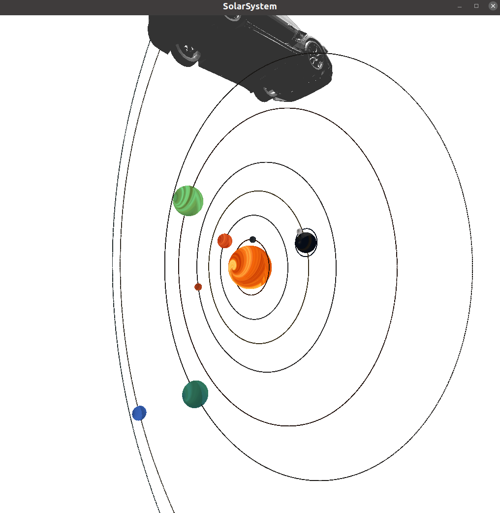

      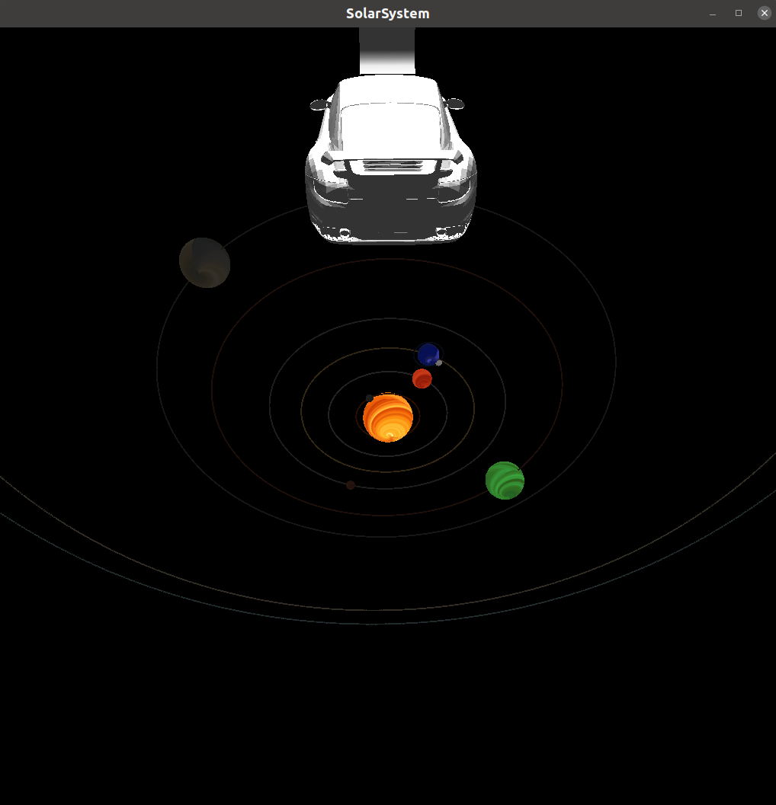

2. **Bonus 10%: Implement a skybox**

Skybox的原理是如果想要渲染非常远的物体，比如该任务下的太阳系远处的星空背景，微小的视角变化不会给背景带来太明显的改变，可以采用定义一个box的方法，程序预先定义好用于生成box的六个面，然后类似于纹理贴图的方式生成足够大，足够远的带纹理的box，即为skybox。

- 本文采用如下的skybox图，例

  

- 程序设计思路

  定义`GLSkyBox.hpp`和`GLSkyBox.cpp`文件实现所需要的skybox功能。实现如下功能：

  - skybox随着观察视角的变化而要微小变化，通过类成员变量POS_X, POS_Y, POS_Z实现。
  - skybox的size为构造时即确定的值。
  - 实现box的六个面的纹理贴图。

  首先，类似上述对星球的texture mapping，在构造的时候创建好对应六张照片的纹理对象，然后在主程序的display函数反复调用中不断进行skybox的display，render的方式和star类似，采用纹理+几何的方式，在vertex上定义对应的texture。

  ```c++
  glBindTexture(GL_TEXTURE_2D, this->texture_id[0]);
  glBegin(GL_QUADS);
  glTexCoord2f(0, 0); glVertex3f(-size, size, -size);
  glTexCoord2f(1, 0); glVertex3f(size, size, -size);
  glTexCoord2f(1, 1); glVertex3f(size, -size, -size);
  glTexCoord2f(0, 1); glVertex3f(-size, -size, -size);
  glEnd();
  ```

  遍历六个纹理对象，以GL_QUADS的方式生成带纹理的六个box面，即为最后的skybox。

- SkyBox效果

  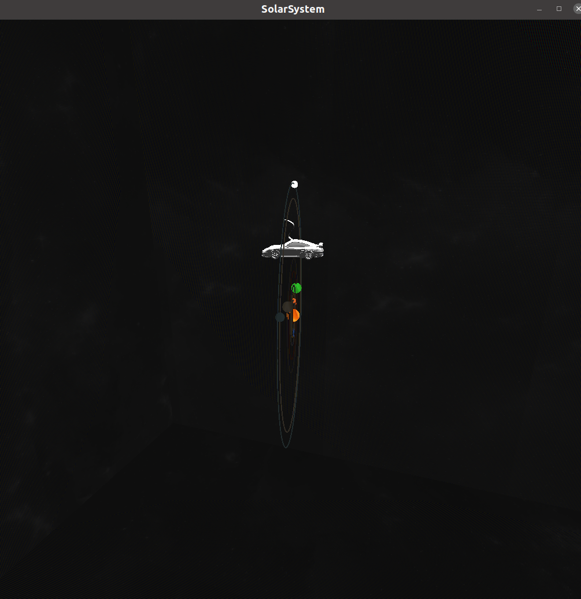

  由于光照为微弱的点光源，导致Skybox显示不是特别明显，但仔细观察可以看出其星空背景。

- 疑问：

  - **为什么屏幕上会产生不规则的纹路？**

### 使用方法

```
git clone https://github.com/xy-cong/Solarsystem_Dreamcar.git
make
./solarsystem_DreamCar
```

